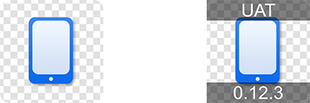

# app-icon

[](https://badge.fury.io/js/app-icon) [](https://circleci.com/gh/dwmkerr/app-icon) [](https://ci.appveyor.com/project/dwmkerr/app-icon) [](https://codecov.io/gh/dwmkerr/app-icon) [](https://david-dm.org/dwmkerr/app-icon) [](https://david-dm.org/dwmkerr/app-icon?type=dev) [](https://dashboard.guardrails.io/default/gh/dwmkerr/app-icon) [](https://greenkeeper.io/) [](https://conventionalcommits.org)

Icon management for Mobile Apps. Create icons, generate all required sizes, label and annotate. Supports Native, Cordova, React Native, Xamarin and more. Inspired by [cordova-icon](https://github.com/AlexDisler/cordova-icon). Node 8 and onwards supported.


<!-- vim-markdown-toc GFM -->

* [Introduction](#introduction)
* [Installation](#installation)
* [Usage](#usage)
    * [Initialising](#initialising)
    * [Generating Icons](#generating-icons)
    * [Labelling Icons](#labelling-icons)
    * [Adaptive Icons](#adaptive-icons)
* [Developer Guide](#developer-guide)
    * [Initial Setup](#initial-setup)
    * [Running Tests](#running-tests)
    * [Commit Messages](#commit-messages)
    * [Creating a Release](#creating-a-release)
    * [Builds](#builds)
    * [Debugging](#debugging)
* [The Sample Projects](#the-sample-projects)
    * [React Native](#react-native)
    * [Cordova](#cordova)
    * [Native](#native)
* [Compatibility](#compatibility)
* [Troubleshooting](#troubleshooting)
* [License](#license)

<!-- vim-markdown-toc -->

## Introduction

This simple tool allows you to create a single icon in your app project, then create icons of all required sizes from it. It currently works for iOS and Android. You can also add labels to your app icons.

Create a single large `icon.png` at least 192 pixels square, or run `app-icon init` to create this icon, then run:

```bash
# If you are using npm 5.2 onwards...
npx app-icon generate

# ...for older versions of npm
npm install -g app-icon
app-icon generate
```

You can also use the module directly in node:

```js
/**
 * appIcon = {
 *   labelImage(inputFilePath, outputFilePath, topText, bottomText),
 *   generate({ sourceIcon, platforms, search }),
 *   templates: {
 *     'AndroidManifest.icons': {...json file...},
 *     'AppIcon.iconset': {...json file...},
 *   },
 * }
 */
import appIcon from 'app-icon';

Promise.resolve()
  .then(() => appIcon.labelImage('./inputfile.png', './out.png', 'UAT', '0.12.3'))
  .then(() => appIcon.labelImage('./inputfile.png', './out.png', 'UAT')) // Bottom text optional
  .then(() => appIcon.labelImage('./inputfile.png', './out.png', null, '0.12.3')) // Top text optional
  .then(() => appIcon.generate()) // will use all default values
  .then(() => appIcon.generate({
    sourceIcon: './icon.png', // Path of the icon to use
    platforms: 'android,ios', // The platforms to generate icons for (i.e. 'android')
    search: './',
  }));
```

## Installation

Install with:

```bash
npm install -g app-icon
```

You will need [imagemagick](http://www.imagemagick.org/) installed:

```bash
brew install imagemagick          # OSX
sudo apt-get install imagemagick  # Debian/Ubuntu/etc
sudo yum install imagemagick      # CentOS/etc
```

## Usage

The `app-icon` tool can be used to create a simple template icon, generate icons of all sizes from a template icon, or label icons.

### Initialising

If you do not already have a single icon to use as the main icon for your project, you can create one with the `init` command:

```bash
app-icon init                    # generates an icon named icon.png
```

You can also add a simple label to the icon.

```bash
app-icon init --caption "App"    # creates an icon with the text 'App'
```

To create template [Adaptive Icons for Android](https://developer.android.com/guide/practices/ui_guidelines/icon_design_adaptive) include the `--adaptive-icons` flag.

### Generating Icons

Add an icon (ideally at least 192x192 pixels) named `icon.png` to your project root (or run `app-icon init`). To automatically generate icons of all sizes for all app projects in the same folder, run:

```bash
app-icon generate
```

If an iOS project is present, then the icon will be copied at all required sizes to:

```
./ios/<ProjectName>/Images.xcassets/AppIcon.appiconset
```

If an Android project is present, then the icon will be copied at all required sizes to:

```
./android/app/src/main/res
```

You can limit the platforms which icons are generated for with the `--platforms` flag, specifying:

```bash
app-icon generate --platforms=ios
app-icon generate --platforms=android,ios
```

By default the tool will generate icons for both platforms.

You can search in specific directories for icons, if the presence of other projects is interfering, just use the `--search` or `-s` parameter:

```bash
app-icon generate -s ./ios -s ./android
```

You can specify the path to the source icon, as well as the folder to search for app projects, just run `app-icon generate -h` to see the options.

### Labelling Icons

Add labels to an icon with the command below:

```bash
app-icon label -i icon.png -o output.png --top UAT --bottom 0.12.3
```

This would produce output like the below image:



This is a useful trick when you are creating things like internal QA versions of your app, where you might want to show a version number or other label in the icon itself.

To label adaptive icons, simply run the `label` command against the _foregroud_ adaptive icon image.

### Adaptive Icons

Support for [Adaptive Icons for Android](https://developer.android.com/guide/practices/ui_guidelines/icon_design_adaptive) is being introduced. This will happen in stages and should be considered an 'alpha' feature until otherwise noted.

The current goals are:

1. Adaptive Icons are 'opt in' for now, they won't be generated by default
2. Creating or generating adaptive icons is done via the `--adaptive-icons` flag

None of the current commands support the `--adaptive-icons` flag. The `init` command will be the first to bring support, then `generate`. If the feature is working well for users then I will document in detail its usage, until then it is an 'experimental' feature!

There is an excellent guide on developing Adaptive Icons [here](https://medium.com/google-design/designing-adaptive-icons-515af294c783).

To test how adaptive icons will look when animated, swiped, etc, the [Adaptive Icons](https://adapticon.tooo.io/) website by [Marius Claret](https://twitter.com/mariusclaret) is very useful!

Note that Adaptive Icons of *all* supported sizes are generated. However, we also generate the `res/mipmap-anydpi-v26/` adaptive icon. This is a large size icon which Android from v26 onwards will automatically rescale as needed to all other sizes. This technically makes the density specific icons redundant. The reason we generate both is to ensure that after `generate` is run, *all* icons in the project will be consistent.

## Developer Guide

The only dependencies are Node 8 (or above) and Yarn.

Useful commands for development are:

| Command              | Usage                                                                                    |
|----------------------|------------------------------------------------------------------------------------------|
| `npm test`           | Runs the unit tests.                                                                     |
| `npm run test:debug` | Runs the tests in a debugger. Combine with `.only` and `debugger` for ease of debugging. |
| `npm run cov`        | Runs the tests, writing coverage reports to `./artifacts/coverage`.                      |

Currently the linting style is based on [airbnb](https://github.com/airbnb/javascript/tree/master/packages/eslint-config-airbnb). Run `npm run lint` to lint the code.

### Initial Setup

Install the dependencies (I recommend [Node Version Manager](https://github.com/creationix/nvm)):

```bash
nvm install 8
nvm use 8
git clone git@github.com:dwmkerr/app-icon.git
cd app-icon
npm install && npm test
```

### Running Tests

Run the tests with:

```bash
npm test
```

Tests are executed with [Mocha](https://mochajs.org/) and coverage is handled by [Istanbul](https://github.com/gotwarlost/istanbul). Coverage reports are written to an `./artifacts` folder.

Note that best practices are to pass Mocha a quoted string with a glob pattern for cross-platform execution of tests (see [Mocha Docs](https://mochajs.org/#the-test-directory)). However for some reason on AppVeyor this doesn't seem to work. Leaving the pattern unquoted works for `cmd` as well as the shell in builds for now. So please be careful if changing the quotes and test on both platforms.

### Commit Messages

[Conventional Commits](https://www.conventionalcommits.org) should be used. This allows the CHANGELOG to be kept up to date automatically, and ensures that semantic versioning can be expected from the library.

### Creating a Release

To create a release.

- Merge your work to master.
- Use `npm run release`.
- Push and deploy `git push --tags && git push && npm publish`

Note that `semantic-version` is used, meaning a changelog is automatically kept up to date, and versioning is handled semantically based on the commit message.

### Builds

Builds are run on CircleCI. You can run the CircleCI build locally with the following command:

```
make circleci
```

The builds use custom docker images which contain the appropriate Node.js runtime, as well as the ImageMagick binaries. These custom images are stored in the `.circleci/images` folder. You can use the `.circleci/images/makefile` makefile to build them, but permissions to push to the `dwmkerr` Docker Hub account are required to publish these images. In general, these should not need to be modified.

### Debugging

The [`debug`](https://www.npmjs.com/package/debug) package is used to support low-level debugging. If you want to see debug messages when running the tool, just set the `DEBUG` environment variable to `app-icon`:

```sh
DEBUG=app-icon app-icon generate --platforms android
```

## The Sample Projects

This project includes some sample apps in the `test` folder, which are used for the tests. You can also run these apps to see the icons produced in action.

### React Native

To run:

```bash
cd ./test/ReactNativeIconTest/
npm install
react-native run-ios
# OR react-native run-android
```

### Cordova

To run:

```bash
cd ./test/CordovaApp/
npm install
cordova run ios
# OR cordova run android
```

### Native

To run the native apps, open the `./test/NativeApp` directory, then open the iOS/Android projects in XCode/AndroidStudio as needed.

## Compatibility

`app-icon` dependds on [ImageMagick](https://www.imagemagick.org/). ImageMagick 6 is installed by default on many Linux distributions, as well as OSX. Some platforms are regularly tested (such as Ubuntu, via CircleCI). Other platforms *may* work but are not tested when I make a release, so your results may vary.

The table below shows the current confirmed compatibility:

| Platform  | `app-icon` | ImageMagick | Status |
|-----------|------------|-------------|--------|
| OSX       | `0.6.x`    | 6, 7        | ✅     |
| Ubuntu 14 | `0.6.x`    | 6           | ✅     |

## Troubleshooting

**Images labelled with `app-icon label` have the text slightly vertically offset**

This seems to be an issue with Imagemagick 6 - try upgrading to 7.

## License

MIT
