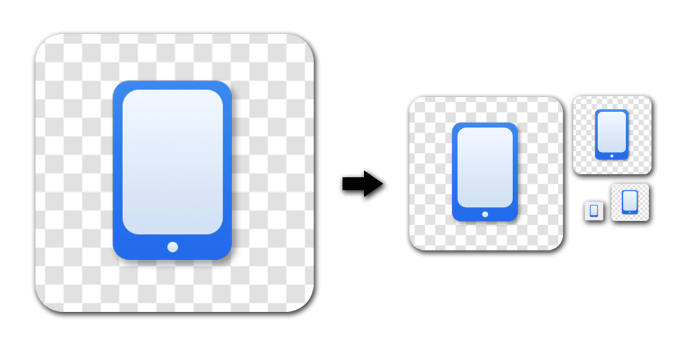

# react-native-icon [](https://circleci.com/gh/dwmkerr/react-native-icon) [](https://codecov.io/gh/dwmkerr/react-native-icon)


Automatic icon resizing for React Native. Inspired by [cordova-icon](github.com/AlexDisler/cordova-icon).



## Introduction

This simple tool allows you to create a single icon in your react-native project, then create icons of all required sizes from it. It currently works for iOS and Android.

This project is inspired by [Alex Disler's](github.com/AlexDisler) superb [cordova-icon](github.com/AlexDisler/cordova-icon) project.

## Installation

Install with:

```bash
npm install react-native-icon
```

You will need [imagemagick](http://www.imagemagick.org/) installed:

```bash
brew install imagemagick          # OSX
sudo apt-get install imagemagick  # Debian/Ubuntu/etc
sudo yum install imagemagick      # CentOS/etc
```

## Usage

Add an icon named `icon.png` to your project root. Then run:

```bash
./node_modules/.bin/react-native-icon
```

The image should be at least 192x192 pixels and square.

If an iOS project is present, then the icon will be copied at all required sizes to:

```
./ios/<ProjectName>/Images.xcassets/AppIcon.appiconset
```

If an Android project is present, then the icon will be copied at all required sizes to:

```
./android/app/src/main/res
```

## Coding

This section will guide you on how to develop with this project.

### Creating a Release

To create a release.

- Merge your work to master.
- Use `nvm version` to bump, e.g. `nvm version patch`
- Push and deploy `git push --tags && git push && npm deploy`
## License

MIT
